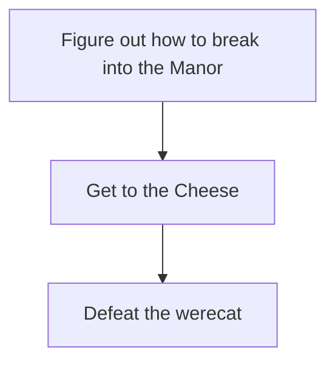
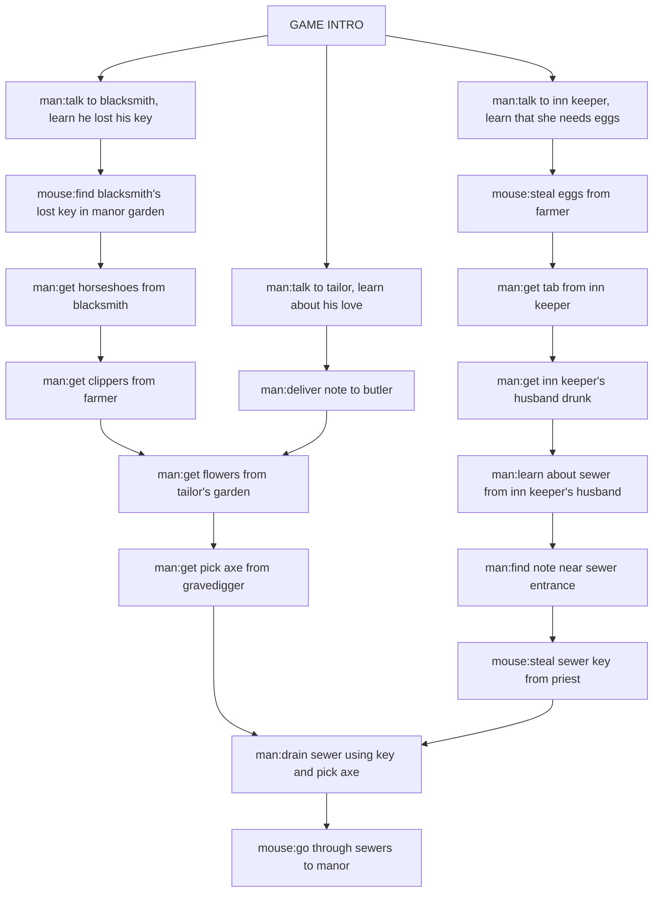
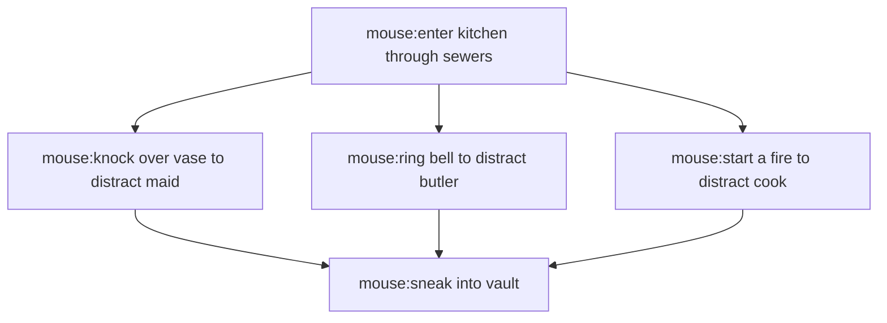

# Notes

## Places in the town of Cheeseshire
- The Manor / Cheesery
- Town Square
    - Inn (Milk & Honey Tavern and Inn)
    - Tailor Shop (Huges' Haberdashery)
    - Blacksmith
    - Church (Church of the Herald)
        - Cemetery
- Farm (Mossy Oak Farm)
- Woods
    - Sewers (entrance)

## People
- Lord Apodemus (BIG CHEESE, is a weremouse)
    - Oliver Wells - Butler
- Meredith Farnsby - Inn keeper
- Liam Farnsby - Inn keeper's husband (sewer scavenger)
- Father Henry Brooks - Priest (is a prick, of couse, also a werecat)
    - Rudy Duncan - Gravedigger (doesn't like new priest who steals money from flower fund)
- Charles Huges - Tailor (has the hots for Oliver)
- Samuel Matthews - Farmer
- Edmund Fitch - Blacksmith

## Puzzle Dependency Charts
### Overview

### Breaking into the Manor

### Get to the Cheese

### Werecat
- Maze with mousetraps??